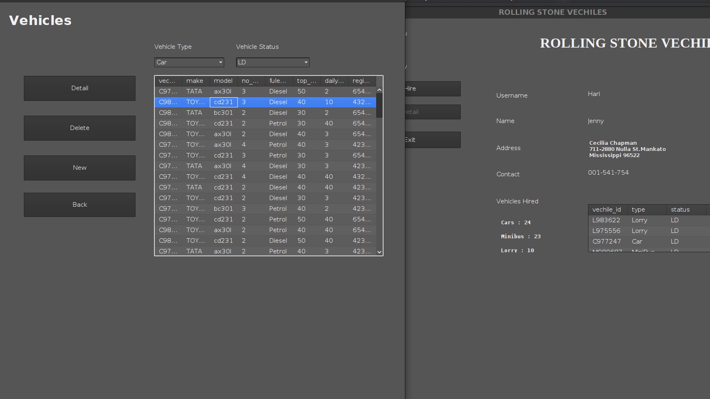

<!-- @format -->

# About

This is java swing project that I have done. This is pretty typical java project wiht GUI. The project is manifestation of my familiariy with concepts like.

1. Object Serialization
2. Unit Testing development approach.
3. Swing framework.
4. Software development life cylce(Agile approach was used).
5. Repository Design Pattern
6. Good use of container and Functional Intefaces(lambdas)

## Description

This is a java application designed for a Vehicle hire Company. Where user (the staff of company and their customer) use the application to hire vehicle fleet and keep track of hired vehicles.

**The appication has two mode of entering.**

    1. As Customer
    2. As Staff

Customer have access to their console from where they can hire and return the vehicle and view what vehicle they currently renting.

Staff have some extra features like, adding new vehicles to fleet, adding customers to the company, and other usual like returning vehichle and hiring them.

# Object Serialization

Here object serialization is done with CSV file, meaning java object are stored as CSV data using `jsefa` library. It makes datamodels easier to analyze after serialization.

# Issues

1. The login info is stored in naked text file, so you might wanna cosider encryting the file before storing password and encryting password too.
2. You cannot add new staff from app, you have add staff info via editing CSV file `LOGINDETAIL.csv`. Also things like changing password can be done from here.

_I leaved these Technical issue of using app as it is, because app is made for purely accademic purpose and some problem could be fixed easily.Fixing them doesn't shows any extra skill in the subject so._

# Some windows

## SignIn window

  
  &emsp;
  &emsp;
  &emsp;
  &emsp;

## Employee Console window

 
  &emsp;

&emsp;

## Vehicle window

From here you can manage current vehicle fleet of your company.
&emsp;

  
  &emsp;

  

  
   &emsp;

### Deleting a Vehicle

  
   
   &emsp;

### Veiwing details of a Vehicle

  

&emsp;
&emsp;

## Employee Console window

  

### Viewing detail of vehicle you hired

  
   &emsp;

  

## Hiring Vehicle

You can hire vechile from directly employee console.
Also from staff console from Hire menu.

  
   &emsp;

## Adding New vehicle to fleet.

  
   &emsp;

  

## Loaning and Returing vehicle from staff console.

In this case you have to enter customer id, for whom you are hiring for.

  
   &emsp;

  

&emsp;

Returing doen't need ID though. It iternally returns the hired vehicle from a customer, as every vehicle has a unique
Vehicle Id irrespective of its type. And every customer has these IDs as list of hired vehicles as their attribute. So, app will search which customer has this vehicle Id in their list of hired vehicles attribute, and simple erase the Vehicle ID from the list.

&emsp;
&emsp;

  
